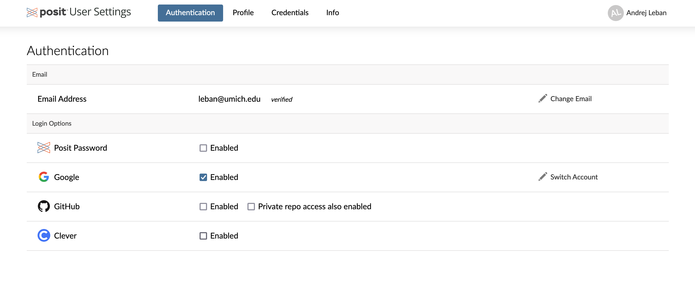
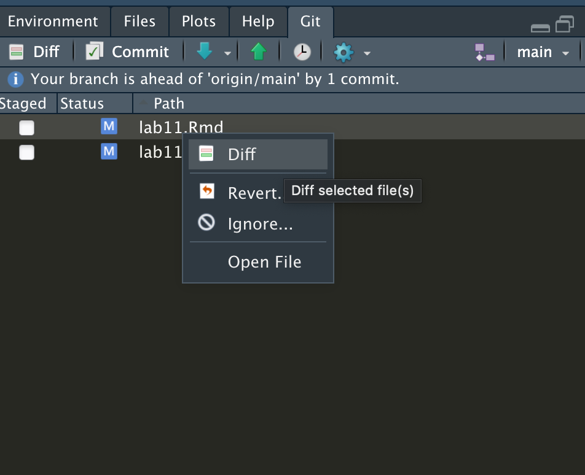
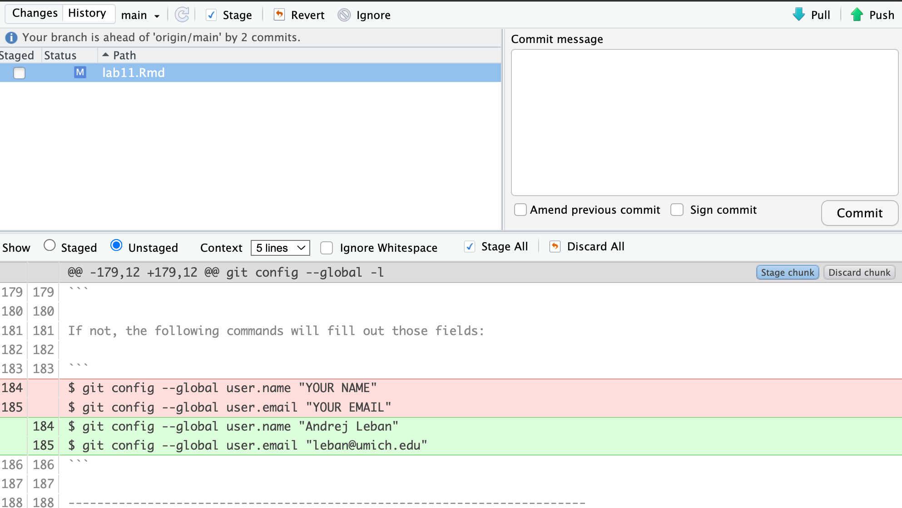
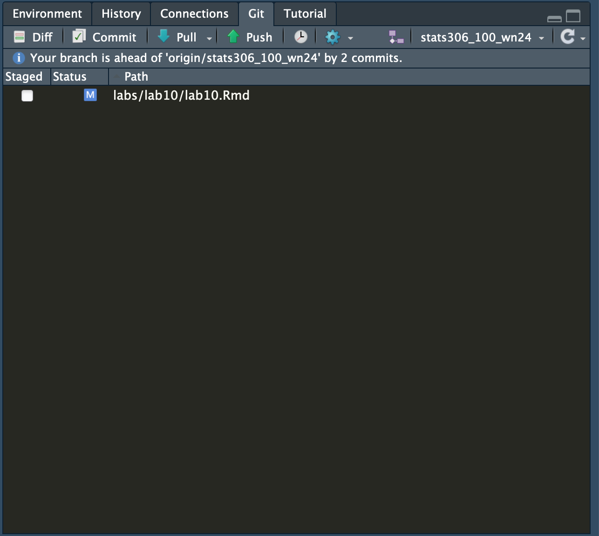

```{r setup, include=FALSE}
library(learnr)     # For interactive exercises
library(dplyr)
library(ggplot2)

knitr::opts_chunk$set(echo = FALSE)
```

------------------------------------------------------------------------

## Github basics

Github is a hosting service for git repositories.
While it has many functionalities, the most important distinction is perhaps between *public* and *privat*e repositories, where the former can be seen by anyone, and the latter can be accessed only by the owner and hand-picked *collaborators*.

Those who already have a GitHub account can go ahead, log in and skip the rest of the below steps.

Head over to [GitHub](https://github.com/) and click on the "Sign up" button to create an account.

1.  Note: if you use your @umich.edu account, you should be eligible for [GitHub Student Developer Pack](https://education.github.com/pack).
    giving you access to a ton of stuff, including a Github Pro account while you're a student.

    For those who already have an account, you can still activate the pack as long as you add your `.edu` email to the emails (not covered here).

------------------------------------------------------------------------

## Creating and using SSH keys

An [SSH key](https://en.wikipedia.org/wiki/Ssh-keygen) authenticates *you* with Github so you (and *only you*) can push from your devices.

Detailed instructions [here.](https://docs.github.com/en/authentication/connecting-to-github-with-ssh/adding-a-new-ssh-key-to-your-github-account?platform=linux){.uri}

------------------------------------------------------------------------

### Creating the keys:

1.  Open the `Terminal` on your Posit Cloud

2.  Paste the following, **after replacing your email in the text**, and hit enter

    ```         
    ssh-keygen -t ed25519 -C "your_email@example.com"
    ```

3.  Press ENTER if presented with something like this:

    `> Enter a file in which to save the key (/home/YOU/.ssh/id_ALGORITHM):[Press enter]`

4.  Enter a password when prompted.
    This is a password you'll need to push to GitHub from this device, so make sure you remember it.

5.  Copy and paste the following command:

    ```         
    eval "$(ssh-agent -s)"
    ```

6.  Similarly:

```         
  ssh-add ~/.ssh/id_ed25519`
```

------------------------------------------------------------------------

### Registering the keys with GitHub

1, Click on your profile icon on GitHub and select *Settings:*

{width="300"}

2.  Click on `SSH and GPH keys` on the left-hand side menu

3.  Click on the green `New-` or `Add SSH key` buttons

4.  Under "Title", give the key a name indicating the device, such as "Posit"

5.  Now go back to the terminal and enter the following command:

    ```         
    cat ~/.ssh/id_ed25519.pub
    ```

6.  Copy the output without any spaces and newlines

7.  Paste it in the "Key" field and click the green "Add SSH key" button.

You should be able to push (that is, "upload") files from your `posit.cloud` instance to GitHub now.

------------------------------------------------------------------------

## Linking GitHub and `posit.cloud`

[details](https://posit.cloud/learn/guide#github-details)

You can also link your (new) GitHub account with posit.cloud if you go to `User Settings/Authentication` and enable github access:

{width="75%"}

This will set your name and email for commit messages, among other features.

------------------------------------------------------------------------

## Git basics - review

-   A **version control system** manages changes from multiple sources simultaneously.
-   A reasonable analogy: Google Docs with track changes turned on
-   Useful for groups working together to track changes to the software package and document why changes were made

------------------------------------------------------------------------

## How does git work?

-   Creates a **repository** (a hidden directory/folder) to information about the history of files

-   In essence, files can be in three "buckets":

    -   When you make changes, they are saved on the disk but not yet registered in git: this is your **working tree**
    -   If you like the changes, you can add them (or a portion of them) to the **staging area,** i.e. the changes are **staged**
    -   When you like your staging area, you **commit** your changes, making a **git commit**.

-   Think of the three stages as a scratchpad, a submission candidate, and a submitted version of a work (homework, project, etc.)

-   To illustrate, below you can see work on this lab tracked in Git as shown in a graphical git client (SourceTree).
    The top pane is the **commit** history, showing **commited changes** accross time (upward direction).
    The very top line shows uncommited changes, which are all the changes since the last commit.\

    \
    Below on the left, the uncommitted changes are further divided into **staged** files/changes (this document), and unstaged ones.

    \
    I we were to commit at this point, the staged changes would go "*on the record* "and show up as a new commit above.

-   {width="50%"}

-   Note that you can only share committed changes with others.

-   Git stores the **differences** ("diffs") from the previous version to your new version.

-   You can **push** your changes to a shared repository for others to use

-   You can **pull** from a shared repository and **merge** the changes of others.

-   If there are **conflicts**, git will let you know and make you resolve them (more on that later.)

-   If you ever need to see what changed, you have the entire **history** of all changes to look at.

------------------------------------------------------------------------

## Git and the CLI

When interacting with git, we will use commands like this:

```         
$ git SUBCOMMAND -o --options ARG1 ARG2 ...
```

Some example subcommands will be `pull` to get updates, `log` to see the history, `add` to stage files, and `commit` to commit changes.

------------------------------------------------------------------------

## Let git know who you are

Git requires every commit to be **signed** by an author.

Run the following command to see whether your name and email are configured already:

```         
git config --global -l
```

If not, the following commands will fill out those fields:

```         
$ git config --global user.name "Andrej Leban"
$ git config --global user.email "leban@umich.edu"
```

------------------------------------------------------------------------

### Exercise - modifying this document and committing the changes

Now go back and fill out your name and email **in the above command in this document (`lab11.Rmd`**).

Then, save the document.

We wish to commit the changes.

First, you can go to your Git pane and view the changes you made to your local/working copy by right-clicking on the file and selecting *Diff:*



This will give you a visual display of the **line-by-line** changes you made, with the additions in green and removals in red, like this:



In the terminal, you can get a text summary of the state of your repository with

```         
git status
```

To commit our changes via the terminal, we first **add** the file:

```         
git add lab11.Rmd
```

The file is now in **staging**.
Since we're OK with the changes, we can proceed with **committing**:

```         
git commit -m "Filled out user info"
```

The `-m` flag provides a message to go with the commit:

-   Every commit requires a message

-   Especially when working with other people, **write informative, concise messages** that summarize the work done in the commit:

    -   Good: "added a function that calculates the mean to script1.R, cleaned up script2.R"

    -   Bad: "stuff", "WIP", "." , "asdasfagad"

-   This makes it easier for people (and the future you!) to get a feel for what's going on with the repository

------------------------------------------------------------------------

## Graphical interface

We teach the command line interface for git because

-   It is convenient to show in slides
-   It is transferable to any environment where you would use git
-   It matches our recommended text book
-   It exposes the full power of git

But, you can also use a graphical interface in Posit Cloud:



You can complete the rest of this Lab either in the terminal or in the graphical interface as the two are equivalent.

------------------------------------------------------------------------

## Sharing your work

When other people update their versions of the repository, you can get their work from the **remote** like this:

```         
git fetch
```

first retrieves information about the changes done on the remote, but does not try to modify anything **locally.** Doing

```         
$ git pull
```

then tries to get the changes and **merge** two versions if the same file has been changed both locally and on the remote.

Most of the time, git is able to resolve the merge automatically.
However, in some cases there is a clear contradiction between the two versions, leading to a merge **conflict**.

Conversely, you will be using

```         
git push
```

to push your new commits to the remote repository, so others can *pull them*.

Note that the order is always `git pull`, then `git push` if there are changes both on the remote and your machine.

------------------------------------------------------------------------

## Exercise: merge conflict!

A **branch** is a separate version of the repository, which has *branched* off from the *main* branch (the default) at some commit history.

Much like when pulling remote changes when same files have been modified, **merging** branches can also lead to conflicts.

We have created a separate branch on the remote that will conflict with this version

Do the following in the terminal and head to the GUI to resolve the conflict:

```         
git pull origin conflict
```

------------------------------------------------------------------------

## References

Good additional references are [Beginning Git and GitHub](https://search.lib.umich.edu/catalog/record/99187305231206381) by Mariot Tsitoara, and for advanced use, [Pro Githttps://git-scm.com/book/en/v2](https://git-scm.com/book/en/v2) by Chacon & Straub.
